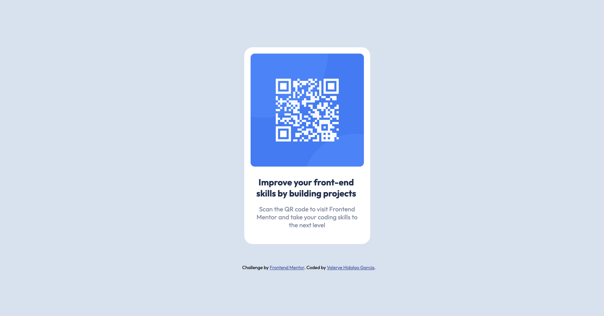

# Frontend Mentor - QR code component solution

This is a solution to the [QR code component challenge on Frontend Mentor](https://www.frontendmentor.io/challenges/qr-code-component-iux_sIO_H).

## Table of contents

- [Overview](#overview)
  - [Screenshot](#screenshot)
  - [Links](#links)
- [My process](#my-process)
  - [Built with](#built-with)
  - [What I learned](#what-i-learned)
  - [Continued development](#continued-development)
  - [Useful resources](#useful-resources)
- [Author](#author)

## Overview
I *just* started learning HTML + CSS in the last week on freeCodeCamp, which is an excellent resource but I needed to practice *outside* of guided projects because I realized I didn't really understand things on my own if there weren't instructions. Don't get me wrong, I love freeCodeCamp's abundant resources but I do need to practice using various resources.

This is where Frontend Mentor enters the picture. I used HTML and CSS to create a QR code component as closely to the example image as possible.

### Screenshot

Here's the QR component I made!

### Links

- Solution URL: [Add solution URL here](https://your-solution-url.com)
- Live Site URL: [Add live site URL here](https://your-live-site-url.com)

## My process

### Built with

- HTML5
- CSS

### What I learned
I learned more about CSS boxes, alignment, and positioning. To figure this out, I watched a YouTube video that I linked in the resources section. I learned that I need a lot more practice and patience, but it was nice to see it coming together. Simple, yes but still something I feel good about since progress is progress! I learned more about styling and the role of ids and classes in CSS.

### Continued development

I want to continue working on my understanding of boxes and positioning, and 'simpler' ways of doing things. Something that was a little hard for me to grasp was the fact that margins can be eaten up so I want to work on my understanding of that. I want to continue with frontend mentor challenges and slowly increasing the complexity of my HTML and CSS! The biggest area of improvement that I need is in CSS, I believe.

### Useful resources

- [Learn CSS Positioning Quickly With A Real World Example](https://www.youtube.com/watch?v=MxEtxo_AaZ4&ab_channel=SlayingTheDragon) - This YouTube video helped me begin to understand the CSS box model, I was really struggling with centering elements and moving them into the positions I wanted prior to watching this!
- [Titles, Subtitles And Paragraphs: HTML H1 Tags And P](https://nestify.io/blog/titles-subtitles-paragraphs-html-h1-tags-p/) - This article does a good job at explaining different tags and their use cases. I was unsure of whether to make the text in the QR card < p > or < h1 > and didn't know if it would fundamentally shift the way I used CSS and this article helped clarify that.
- [How to Import Google Fonts in CSS File](https://www.w3docs.com/snippets/css/how-to-import-google-fonts-in-css-file.html) - This article quickly explains how to add Google Fonts to your projects with examples. It helped me correct an error in which I included the link in the main HTML and CSS but still couldn't get the text to appear in the fonts needed. 
- [Responsive website: How to get rid of horizontal scroll bar?](https://stackoverflow.com/questions/18645870/responsive-website-how-to-get-rid-of-horizontal-scroll-bar) - I used this article to figure out how to hide the horizontal scroll bar, prior to reading it I was trying to add overflow-x:hidden to each element individually.

## Author

- Frontend Mentor - [@valeryehg](https://www.frontendmentor.io/profile/valeryehg)